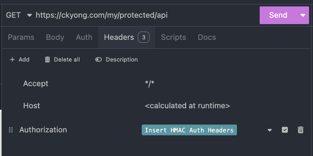
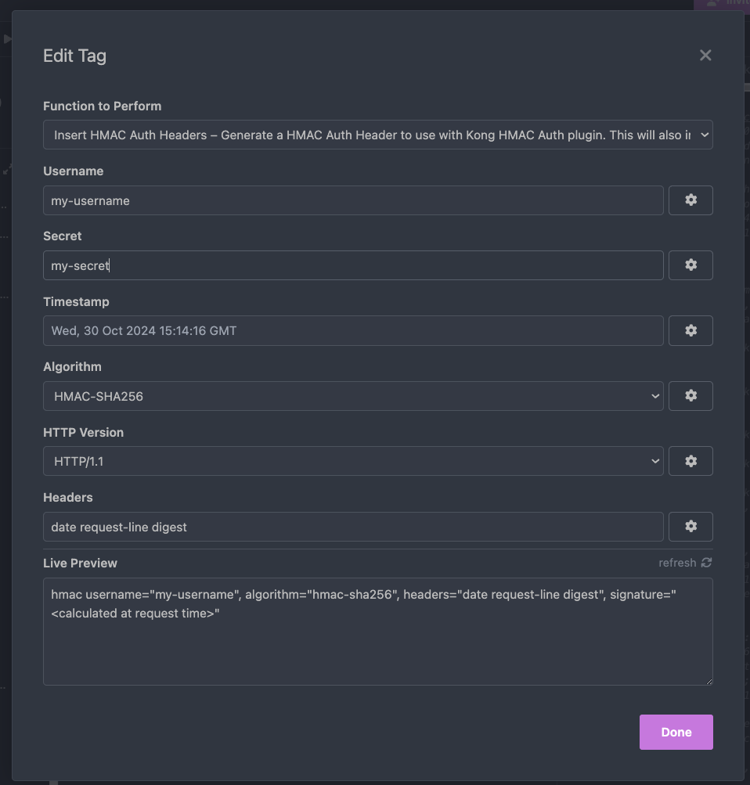
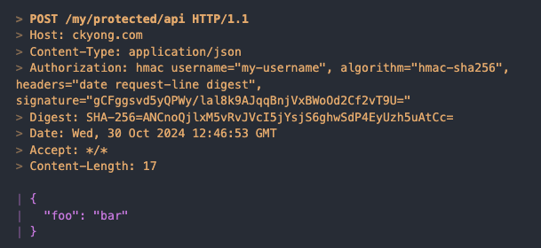

# Kong HMAC Auth plugin
This plugin was originally written as I am using the [Kong HMAC Auth plugin](https://docs.konghq.com/hub/kong-inc/hmac-auth/). It should work if you have the config below, but will be extended to be more flexible, if I can find the time.

```yaml
apiVersion: configuration.konghq.com/v1
config:
  enforce_headers:
    - date
    - request-line
    - digest
  hide_credentials: true
  validate_request_body: true
kind: KongPlugin
metadata:
  name: hmac-auth-plugin-example
plugin: hmac-auth

```

# How to use
Setup a call to your API, that is protected with the mentioned plugin.

In the `Headers` tab, add an `Authorization` header. Press `Ctrl + Space` to open the suggestion menu, and type `Insert HMAC Auth Headers`. Press Enter to select it (see screenshot).


Click on the tag, and fill in your options.


You should now be able to make the call, and the plugin will add the necessary headers (date, request-line, digest):


# Changelog
### `0.0.2` 
* Fixed faulty image in documentation.
### `0.0.1` 
* Initial functionality, support `date request-line digest` format, and all supported algorithms.